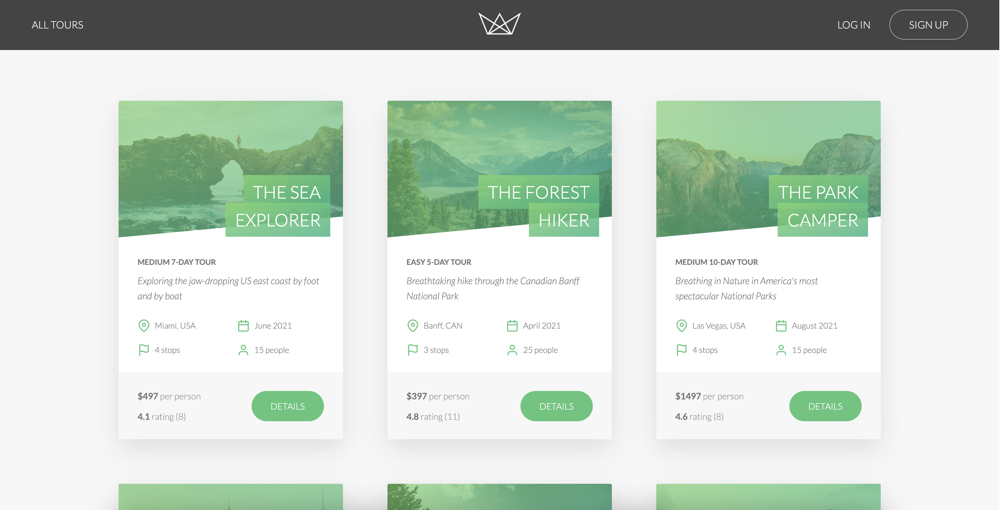
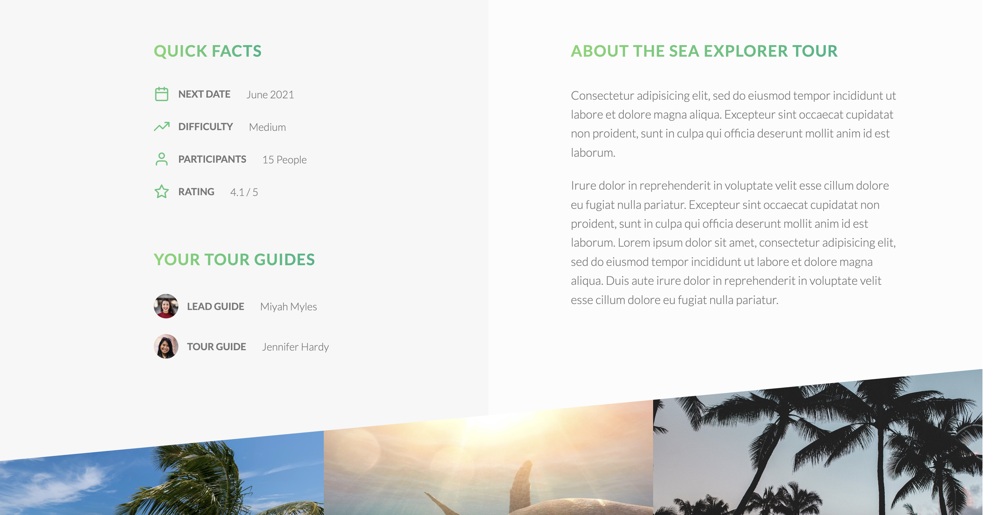
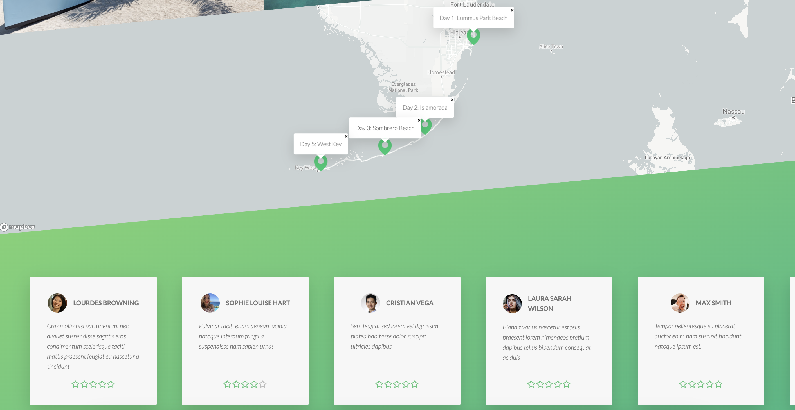

# ✈️ NATOURS
A fast, scalable, and feature-rich RESTful API called NATOURS for all things tours and bookings, built using Node.js, Express, and MongoDB. The application supports full server-side rendering and is optimized for both performance and scalability.

## 📷 Screenshots

### Landing Page


### Tour Info


### Interactive Map + Reviews



## 🛠️ Tech Stack
- Backend: Node.js, Express, MongoDB
- Frontend: Pug (for server-side rendering)
- Payments: Stripe 
- Email Services: Mailtrap, Sendgrid
- Geolocation: Mapbox for interactive maps

## 🚀 Developement Features
- 🔍 RESTful API – CRUD operations, filtering, sorting, and pagination.
- 🔒 Authentication – JWT-based, password reset, secure cookies.
- 🔐 Security – Data sanitization, rate limiting, and encryption.
- 💳 Payments – Stripe integration for processing payments.

## 💻 Application Features
- Authentication and Authorization
  - Sign up, Log in, Logout, Update, and reset password.
- User profile
  - Update username, photo, email, password, and other information
  - A user can be either a regular user or an admin or a lead guide or a guide.
  - When a user signs up, that user by default regular user.
- Tour
  - Manage booking, check tour map, check users' reviews and rating
  - Tours can be created by an admin user or a lead-guide.
  - Tours can be seen by every user.
  - Tours can be updated by an admin user or a lead guide.
  - Tours can be deleted by an admin user or a lead-guide.
- Bookings
  - Only regular users can book tours (make a payment).
  - Regular users can not book the same tour twice.
  - Regular users can see all the tours they have booked.
  - An admin user or a lead guide can see every booking on the app.
  - An admin user or a lead guide can delete any booking.
  - An admin user or a lead guide can create a booking (manually, without payment).
  - An admin user or a lead guide can not create a booking for the same user twice.
  - An admin user or a lead guide can edit any booking.
- Reviews
  - Only regular users can write reviews for tours that they have booked.
  - All users can see the reviews of each tour.
  - Regular users can edit and delete their own reviews.
  - Regular users can not review the same tour twice.
  - An admin can delete any review.
- Favorite Tours
  - A regular user can add any of their booked tours to their list of favorite tours.
  - A regular user can remove a tour from their list of favorite tours.
  - A regular user can not add a tour to their list of favorite tours when it is already a favorite.
- Credit card Payment

## 💳 Booking a Tour
- Login to the site and search for tours
- Book a tour and proceed to payment page
- Enter the card details :
  ```
  - Card No. : 4242 4242 4242 4242
  - Expiry date: 02 / 22
  - CVV: 222
  ```
- Congrats, you are going on a tour!!!!